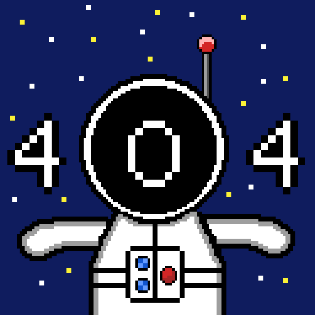

#  404
Welcome to the repository for Team 404, a stellar project group for CSE110 at UCSD! We are on a mission to create an out-of-this-world software development project. Join us as we navigate the cosmos of coding and teamwork.

## Introduction
*Welcome aboard space cadets!* 
Team 404 is committed to exploring the vast universe of software development. Out project inegrate a captivating space them, offering a unique and engaging way for developers to document their journey. From designing glaxies of code to solving interstellar gugs, our project aims to provide a robust and immersive experience.

## Our Repository
Our repository is the command center of our project. Here's your mission briefing on its layout:
- `admin/`: Contains all administrative resources, including our Team 404 branding assets, CI/CD pipeline information, meeting notes, and weekly progress reports.
- `design in specs/`: Houses all our design boards for the homepage and each individual feature, created on Miro.
- `docs/`: I do not know what's in here, can someone add pls
- `img/`: Contains useful elements'images like our emoticons, the planets shown throughout the project, and other miscellaneous animations.
- `specs/`: Contains our ADRs, individual team member brainstorms, and our pitch slides.
- `src/`: The core of our project where all the source code resides. 

## Developer Journal
### How To Use
*Ready to launch? Here's your pre-flight checklist:*

1. **You can access the journal here**: [Developer Journal](https://cse110-sp24-group20.github.io/cse110-sp24-group20/)

2. **Using the Homepage**:
   - When you first visit the Developer Journal, you will be greeted by the homepage, which features a space-themed interface.
   - The homepage displays a spaceship in the center with interactive options around it. These options are typically represented as planets, and each one corresponds to a different feature of the journal.
   - Click on the planets (or the buttons) to navigate to different sections of the journal.

3. **Features**:

   **Reflect on the Day**:
   - Click on the "Reflect on the Day" planet to open the reflection interface.
   - Here, you can write about your day, note any significant events, feelings, or achievements.
   - This feature helps in maintaining a daily log of your thoughts and experiences.

   **Schedule Your Day**:
   - Click on the "Schedule Your Day" planet to open the daily scheduler.
   - You can add tasks, set reminders, and organize your day efficiently.
   - This helps in keeping track of your daily activities and ensuring productivity.

   **Schedule Your Month**:
   - Click on the "Schedule Your Month" planet to access the monthly planner.
   - Plan out your month by adding important dates, goals, and tasks.
   - This feature is great for long-term planning and setting monthly objectives.

   **Track a Project**:
   - Click on the "Track a Project" planet to enter the project tracking interface.
   - Add new projects, update progress, and manage deadlines.
   - This feature helps you stay on top of your projects and ensures you meet your milestones.
   
 *Check out our demo video for a guided tour of the finished product: [Demo Video Link]()* 
**INSERT DEMO VIDEO ONCE COMPLETED**  

### Testing Utilized and General Build Process
To ensure our project remains stable and bug-free as it travels through the cosmos, we employ a rigourous testing and review process:

- **Jest Unit Testing**: Every component is tested to ensure it functions correctly.
- **Protected Main Branch**: All changes to the main branch require human review and testing. 
- **Codacy Automatic Review**: Our code is automatically reviewed for quality and consistency.
- **Dedicated PR Review Team**: A  team of developers reviews all pull requests to maintain code integriity.
- **E2E Testing with Puppetteer**: End-to-end testing to simulate user interactions and ensure everything works as expected.

### Fun Features
*TODO: Explain how the garbage black hole works* 
*TODO: Explain how the gproject tracker works with all its buttons*

## Important Links
-  [Team Page](https://cse110-sp24-group20.github.io/cse110-sp24-group20/admin/team.html)
- [Sentiment Widget](https://cse110-sp24-group20.github.io/warmup-exercise/)
- [Design and Inspiration Board](https://miro.com/app/board/uXjVKNISHwk=/?share_link_id=576063224816)
- [Starting Pitch Slides](https://docs.google.com/presentation/d/1XM8Uf43_SsPsqYF8VAFeeAE-i8acFYfE/edit?usp=sharing&ouid=111349215821081964117&rtpof=true&sd=true)

## Team Agenda and Action Plans (UCSD Restricted)
- [Week 2 - Group Kickoff and Team Branding](https://docs.google.com/document/d/1yzLrVUtwJmrQ68DPAA6afpxohxKKO2E4eC-_4uID680/edit)
- [Week 3 - Team Contract](https://docs.google.com/document/d/15mF2mpcLLf5Oe0fnNDoXHUj939dCAirqgcebsFFDy-w/edit)
- [Week 4 - Sentiment Widget Planning](https://docs.google.com/document/d/1ysq4WFbjsmEBw-Oj4d_Fahja3ulLQXkpKWMOmJw4Wbw/edit)
- [Week 5 - Brainstorming/Starting Pitch](https://docs.google.com/document/d/1mrsB5nUFdbxZu8t8xpUFAwBF3jD9fcPrrDOP-OsmXrE/edit)
- [Week 6 - ADR/Pipeline assignments](https://docs.google.com/document/d/1eZZqLK8mjrwdlCh4X4SJAX0UNBqJf80z57Zfoi1hcS0/edit?usp=sharing)
- [Week 7 - Final Project Team assignments and Feature Outline](https://docs.google.com/document/d/1dZmwqVCs0ZC4plcDEWnxN-K4PJR0swP2MpI4Dj3yGbQ/edit?usp=sharing)
- [Week 8 - Team Progress Check](https://docs.google.com/document/d/1jyHvgMBJ21IVbKARUtSgecBZsP3IoNrsW3pQSRrcHDA/edit)
- [Week 9]()
- [Week 10]()

