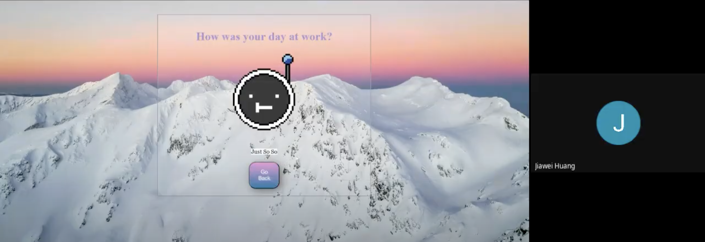
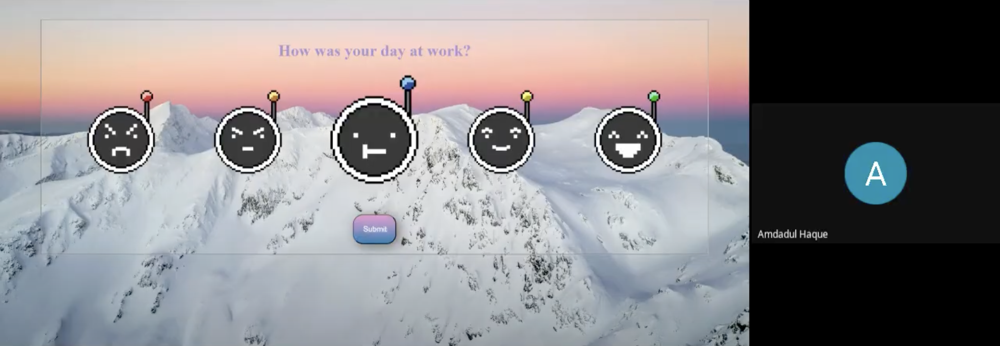

# Team 20: 404
### Type of meeting
  Sprint Meeting 1: Review what we accomplished from for the Warm-Up Exercise. 
### Date and Time
  April 28, 2024
### Present Members
  Yvanna Cardenas, Brandon Rogers, Joseph Toscano, Beijie Cheng, 
  Jiawei Huang, Jiaying Yang, Joseph Jun, Zhaoyu Dou, Royce Huang, Amdadul Haque
### Absent Members
  N/A
## Agenda
### Previous Meeting
  - Check-in and finalize the development of the widge's structure, move to Video and SWOT.
### New Business
  - First try of the Sprint Meeting
  - Describe the contribution to the Warm-Up Exercise
  - Demo recording for the Sprint Meeting
  - Set up Retrium
### For Next Meeting
  - Using Retrium for the Retrospective Meeting.
  - Record demo for the Retrospective Meeting.
### Key Topics from this Meeting  
  - Contributions for the Warm-Up Exercise: 
  - HTML: 
    --Brandon - radio buttons put them together, set up the project. 
    --Royce: at the beginning for starting, worked on video later. 
    --Yvanna: unify code, and the documentation, add the sound effect.
    --Jessica: structure, CSS file font-size and image-size, wrap & size adjustment. 

  - CSS: 
    --Amdahl: check if everything worked as they should.
    --Zhaoyu: pattern, background, color
    --Joey: design, GitHub issues, SWOT analysis

  - JS: 
    --Jiawei: messages, submit buttons
    --Joseph: design, JS: click and wait for textbook and the message, animation part: pop-up

  - Debugging or Logistic:
    --Brandon: webdev tool
    --Yvanna: design, documation, user stories. 
    --Joey: git issues

  - Youtube & Documentation:
    --Yvanna: editing and performing, main documentation
    
  - SWOT:
    --Jiaying: finished O and T session.

### Screen Captures

